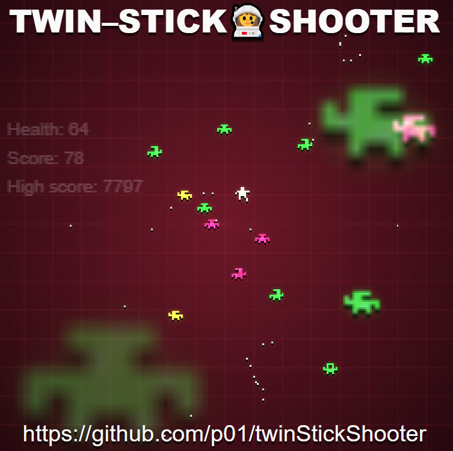

# Twin-Stick Shooter

Basics of a Twin–stick shooter written in ES6 for the workshop at [FRONTFEST MOSCOW](https://2017.frontfest.ru/en/) on November 18th, 2017.

## How we'll work

We will discuss about the Twin-Stick Shooter game genre, how to structure a game, and we will have two coding sessions to implement the key parts of a Twin-Stick Shooter in ES6.

## What you'll need

Bring your laptop, a copy of this repository, a recent browser and editor and you're set.

The `workshop` folder contains the basics of the game and classes with comments for the different tasks to implement during the coding sessions.

The folder `solutions` and the files `solution1.js` to `solution9.js` contain the basic implementation of the tasks and some additional hints in case you get stuck or want to focus on other tasks.

## Additional content

Check the `finished` folder to see a working implementation.

The `polished` folder for a more funky version.

## What is this all about ?

Enjoy

Mathieu [@p01](https://twitter.com/p01) Henri - [p01.org](http://www.p01.org)
